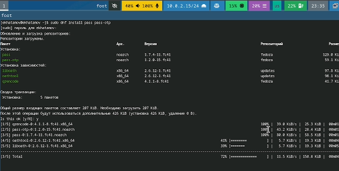
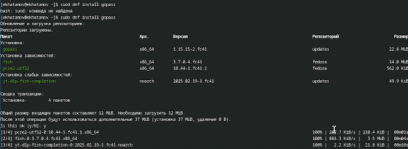
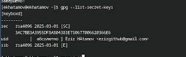
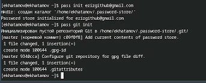
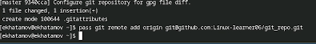
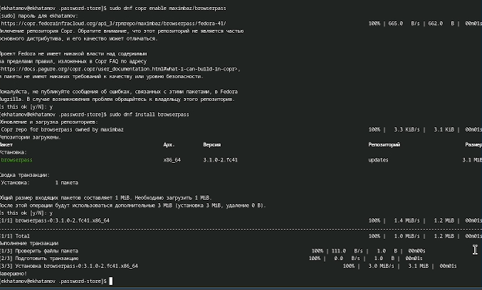
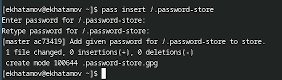
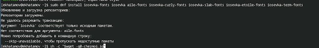

---
## Front matter
title: "Отчёт по лабораторной работе 5"
subtitle: "Менеджер паролей pass"
author: "Хатамов Эзиз"

## Generic otions
lang: ru-RU
toc-title: "Содержание"

## Bibliography
bibliography: bib/cite.bib
csl: pandoc/csl/gost-r-7-0-5-2008-numeric.csl

## Pdf output format
toc: true # Table of contents
toc-depth: 2
lof: true # List of figures
lot: true # List of tables
fontsize: 12pt
linestretch: 1.5
papersize: a4
documentclass: scrreprt
## I18n polyglossia
polyglossia-lang:
  name: russian
  options:
	- spelling=modern
	- babelshorthands=true
polyglossia-otherlangs:
  name: english
## I18n babel
babel-lang: russian
babel-otherlangs: english
## Fonts
mainfont: IBM Plex Serif
romanfont: IBM Plex Serif
sansfont: IBM Plex Sans
monofont: IBM Plex Mono
mathfont: STIX Two Math
mainfontoptions: Ligatures=Common,Ligatures=TeX,Scale=0.94
romanfontoptions: Ligatures=Common,Ligatures=TeX,Scale=0.94
sansfontoptions: Ligatures=Common,Ligatures=TeX,Scale=MatchLowercase,Scale=0.94
monofontoptions: Scale=MatchLowercase,Scale=0.94,FakeStretch=0.9
mathfontoptions:
## Biblatex
biblatex: true
biblio-style: "gost-numeric"
biblatexoptions:
  - parentracker=true
  - backend=biber
  - hyperref=auto
  - language=auto
  - autolang=other*
  - citestyle=gost-numeric
## Pandoc-crossref LaTeX customization
figureTitle: "Рис."
tableTitle: "Таблица"
listingTitle: "Листинг"
lofTitle: "Список иллюстраций"
lotTitle: "Список таблиц"
lolTitle: "Листинги"
## Misc options
indent: true
header-includes:
  - \usepackage{indentfirst}
  - \usepackage{float} # keep figures where there are in the text
  - \floatplacement{figure}{H} # keep figures where there are in the text
---

# Цель работы

Получение навыков правильной работы с репозиториями git.

# Теоретические сведения

* Gitflow Workflow опубликована и популяризована Винсентом Дриссеном.

* Gitflow Workflow предполагает выстраивание строгой модели ветвления с учётом выпуска проекта.

* Данная модель отлично подходит для организации рабочего процесса на основе релизов.

* Работа по модели Gitflow включает создание отдельной ветки для исправлений ошибок в рабочей среде.

* Последовательность действий при работе по модели Gitflow:

* Из ветки master создаётся ветка develop.

* Из ветки develop создаётся ветка release.

* Из ветки develop создаются ветки feature.

* Когда работа над веткой feature завершена, она сливается с веткой develop.

* Когда работа над веткой релиза release завершена, она сливается в ветки develop и master.

* Если в master обнаружена проблема, из master создаётся ветка hotfix.

* Когда работа над веткой исправления hotfix завершена, она сливается в ветки develop и master.

# Выполнение лабораторной работы

## Kоманды для установки инструментов управления 

Установка

{ #fig:001 width=70% height=70% }

Это команды для установки инструментов управления паролями в Fedora.

{ #fig:002 width=70% height=70% }

Это команды для установки инструментов управления паролями в Fedora.

{ #fig:003 width=70% height=70% }

Создадим структуру git

Если ключа нет, нужно создать новый

{ #fig:004 width=70% height=70% }

Инициализация хранилища

{ #fig:005 width=70% height=70% }

Создадим структуру git

Также можно задать адрес репозитория на хостинге (репозиторий необходимо предварительно создать)

Для синхронизации выполняется следующая команда

Проверить статус синхронизации

{ #fig:006 width=70% height=70% }

Для взаимодействия с броузером используется интерфейс native messaging.

Поэтому кроме плагина к броузеру устанавливается программа, обеспечивающая интерфейс native messaging.

{ #fig:007 width=70% height=70% }

{ #fig:009 width=70% height=70% }

Установите дополнительное программное обеспечение:

{ #fig:010 width=70% height=70% }

Установите шрифты.

# Вывод

Лабораторная работа №5 посвящена изучению менеджера паролей pass, который позволяет безопасно хранить и управлять паролями с использованием GPG-шифрования и интеграции с Git для синхронизации данных.
